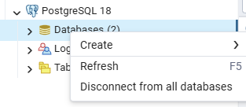
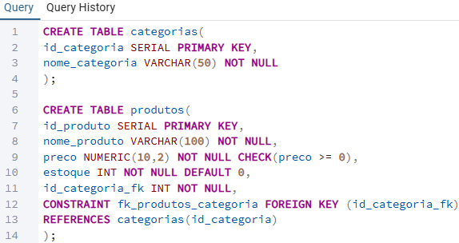

# Aula 01 - Introdução ao Banco de Dados Relacional


## 🧠 Meu Resumo
- **Banco de Dados Relacional:** Guarda informações em tabelas (linhas e colunas).
- **Linhas (Registros ou Tuplas):** Cada linha é uma ocorrência.
- **Colunas (Campos ou Atributos):** Cada coluna é uma característica daquela ocorrência.
- **Entidade:** Algo do mundo real que precisa ser armazenado(guardar informações) - logo será a tabela.
- **Atributo:** Características da entidade, logo serão colunas.
- **Banco Relacional:** O que o torna relacional é que as tabelas se conectam entre si através da FK (Chave Estrangeira).


## 🧠 Entendendo Sobre Relacionamentos e Normalização

- **Relacionamento** Ligação entre entidade(tabela) - Define como conversam.
- **Cardinalidade dos Relacionamentos:** Como as regras de negócio definem a proporção dos dados:
  * **1:1 (Um para Um):** Ex: Usuário e suas Configurações.
  * **1:N (Um para Muitos):** Ex: Um Cliente e seus Pedidos.
  * **N:N (Muitos para Muitos):** Ex: Pedidos e Produtos (exige tabela intermediária).
- **Normalização de dados(Tem 3 Formas Normais):** Evita dados duplicados, organiza os dados evitando redundância:
  * **1FN:** Valores atômicos (únicos por célula) e criação da Chave Primária.
  * **2FN:** Dependência funcional total da Chave Primária.
  * **3FN:** Eliminação de dependências transitivas (coluna comum dependendo de outra coluna comum).

### 🧠 Entendendo Melhor com exemplos

*   **1:1** — Um funcionário tem um crachá
*   **1:1** — Um usuário tem um perfil
*   **1:N** — Uma escola tem vários alunos
*   **1:N** — Um cliente tem vários pedidos
*   **N:N** — Alunos fazem vários cursos
*   **N:N** — Pedidos têm vários produtos


> ⚠️ **Regra de Ouro:** O banco relacional **não aceita** ligação N:N direta. A solução obrigatória é criar uma **Tabela Associativa** no meio para organizar a bagunça.

---
### 🧠 Entendendo Melhor com exemplos

**1FN (Primeira Forma Normal)** — "Cada coisa no seu quadrado"

`TABELA_TELEFONE(id_telefone, numero, id_cliente)`. Se o cliente tiver 3 telefones, ele ganhará 3 linhas organizadas nesta tabela.

**2FN (Segunda Forma Normal)** — "Quem manda é a chave inteira"
*(Tabela Associativa):* `PEDIDO_PRODUTO(id_pedido, id_produto, quantidade)`. O campo `quantidade` precisa obrigatoriamente do pedido **E** do produto juntos para fazer sentido.


**3FN (Terceira Forma Normal)** — "Sem intermediários""
Em vez de colocar o endereço no cliente, separamos em duas caixas:

* `CLIENTES(id_cliente, nome, cep)`
* `ENDERECOS(cep, cidade, estado)`


> 💡 **Nota de Aprendizado:** Toda essa separação de tabelas parece complexa agora, mas fará todo o sentido quando estiver aprendenddo o comando `JOIN`. É o `JOIN` que junta essas tabelas separadas na hora de gerar um relatório!


> 💡 **Por que isso existe (e não simplesmente "uma planilha gigante com tudo junto")?**

Porque separar a informação em tabelas relacionadas evita **redundância** e **inconsistência**.


## 📊 Estudo de Caso Prático: (SQL )

Imagine juntar `clientes`, `produtos`, `categorias`, `pedidos`, `itens_pedido` e `funcionarios` em uma única tabela. Seria o caos.

*   **Para o PostgreSQL:** Separar os dados significa que o texto da categoria ou o e-mail do cliente é gravado uma única vez. A tabela de movimentação (`itens_pedido`) só carrega números de ID. Isso economiza espaço e permite atualizar o cadastro de um funcionário em 1 segundo sem mexer no histórico de vendas.

---

## 🔑 Chaves em Banco de Dados:

- **Chave Primária (Primary Key - PK):** Nunca se repete, nem é nula. Identifica cada linha de forma única dentro da própria tabela.

### 💻 Prática em SQL
```sql
-- 1. Criando a tabela de Clientes
CREATE TABLE clientes (
    id_cliente SERIAL PRIMARY KEY,
    nome VARCHAR(100) NOT NULL,
    email VARCHAR(100) UNIQUE NOT NULL
);
```
> 👁️ Observação (PostgreSQL): Ao colocar SERIAL, o Postgres já entende que é um número inteiro com auto-incremento (cria a sequência automática). Ao definir como PRIMARY KEY, a regra NOT NULL já é aplicada automaticamente pelo próprio Postgres.

- **Chave Estrangeira (Foreign Key - FK):**
Chave Estrangeira (Foreign Key - FK): Cria o relacionamento entre tabelas. Aponta para a PK de outra tabela para conectar os dados.

---
🧠 Meu Resumo da Chave Estrangeira
* O que faz: Cria o relacionamento entre tabelas.

* Como funciona: Pega a chave primária (PK) de uma tabela pai (ex: clientes) e coloca como uma coluna na tabela filho (ex: pedidos).

* Regra do Tipo: A coluna da FK precisa ter o mesmo tipo de dado da PK com a qual se relaciona.

* Identidade Própria: A tabela que recebe a FK continua tendo sua própria PK individual.

* Referência: Chama a tabela e o ID com o qual está se relacionando.
  

## 💻 Prática em SQL

```sql
-- 2. Criando a tabela de Pedidos relacionada
CREATE TABLE pedidos (
    id_pedido SERIAL PRIMARY KEY,    -- Chave Primária (PK) do pedido
    data_pedido DATE NOT NULL,
    valor NUMERIC(10,2),              -- Pode ser também o DECIMAL - SÃO O MESMO TIPO.
    id_cliente_fk INT NOT NULL,               -- Coluna para guardar o ID do cliente (FK)
    
    -- Criando a regra da Chave Estrangeira (FK)
    CONSTRAINT fk_pedidos_clientes 
    FOREIGN KEY (id_cliente_fk) 
    REFERENCES clientes(id_cliente)
);
```

> 👁️ Observação: Colocar o sufixo _fk no final do nome da coluna (ex: id_cliente_fk) facilita a identificação rápida da Chave Estrangeira ao ler o código.

---

## As 5 "famílias" de comandos SQL

| Sigla | Nome | Para quê | Comandos |
|---|---|---|---|
| **DDL** | Data Definition Language | Define a estrutura (tabelas, colunas, tipos) | `CREATE`, `ALTER`, `DROP`, `TRUNCATE` |
| **DML** | Data Manipulation Language | Manipula os dados dentro das tabelas | `INSERT`, `UPDATE`, `DELETE` |
| **DQL** | Data Query Language | Consulta os dados | `SELECT` |
| **DCL** | Data Control Language | Controla permissões e acesso | `GRANT`, `REVOKE` |
| **TCL / DTL** | Transaction Control Language | Controla transações (operações tudo-ou-nada) | `BEGIN`, `COMMIT`, `ROLLBACK` |

## 📦 Entendendo as Famílias do SQL (A Metáfora do Estoque) - Meu Resumo 

Para fixar a lógica de cada sigla, criei uma analogia prática pensando no gerenciamento de um estoque de mercadorias:

| Família | Nome Técnico | O que faz no Estoque? (Analogia Prática) | Meu Entendimento |
| :---: | :--- | :--- | :--- |
| **DDL** | Data Definition Language | **Constrói as prateleiras** | Cria e modifica a estrutura do banco (Definição). |
| **DML** | Data Manipulation Language | **Coloca, troca ou retira** os produtos das prateleiras. | Insere, atualiza e deleta as linhas de dados (Manipulação). |
| **DQL** | Data Query Language | **Responde às perguntas** sobre as mercadorias guardadas. | Consulta o banco e extrai informações para relatórios (Consulta). |
| **DCL** | Data Control Language | **Decide quem tem a chave** das portas do estoque. | Controla quais usuários têm permissão de acesso (Segurança). |
| **DTL / TCL** | Transaction Control Language | **Garante o resultado da ação.** (Não adianta tirar de uma prateleira se não houver onde colocar do outro lado). | Controla as transações de forma "tudo ou nada" (Consistência). |

---

```sql
-- 1. Criar o banco de dados de treinos
CREATE DATABASE nome_do_banco;

```
> 👁️ Observação: No pgAdmin, após criar o banco de dados, clicar com  botão direito em "Databases" na barra lateral esquerda, conforme o print e seleciona Refresh(Atualizar), clica duas vezes em cima do novo banco para entrar nele, depois é só criar as tabelas. 
>


---

## 🚀 Desafio de Código:

**Cenário de Negócio:** Criar a estrutura inicial para cadastrar os produtos do e-commerce. Cada produto precisa pertencer a uma categoria pré-existente.**Instruções:** Escrever um script SQL que crie duas tabelas:

* A tabela categorias (deve conter id_categoria como PK e nome_categoria).
  
*A tabela produtos (deve conter id_produto como PK, nome_produto, preco com uma regra para não ser negativo e o DEFAULT 0 para o estoque e a Chave Estrangeira apontando para a tabela de categorias).


```sql
CREATE TABLE categorias(
id_categoria SERIAL PRIMARY KEY,
nome_categoria VARCHAR(50) NOT NULL
);

CREATE TABLE produtos(
id_produto SERIAL PRIMARY KEY,
nome_produto VARCHAR(100) NOT NULL,
preco NUMERIC(10,2) NOT NULL CHECK(preco >= 0),
estoque INT NOT NULL DEFAULT 0,
id_categoria-fk INT NOT NULL,   -- Aqui errei na digitação -- corrigido na imagem  -- ❌ hífen no nome

CONSTRAINT fk_produtos_categoria(id_categoria_fk) REFERENCES categorias(id_categoria)  -- Aqui esqueci do FOREIGN KEY  -- Corrigido na imagem ❌ faltou FOREIGN KEY
);

```

### 💻 Código Executado com Sucesso

Abaixo está o registro da execução das tabelas `categorias` e `produtos` dentro do pgAdmin 4:




---

## 🛠️ Descoberta Prática: Sintaxe de Chave Estrangeira (FK)

Durante a prática no pgAdmin, aprendi que existem duas maneiras de interligar as tabelas no PostgreSQL:

### 1. Forma Profissional (Com Nome de Regra)
Dar um nome específico para a nossa regra de relacionamento (`CONSTRAINT`) para não ficar perdido. É a melhor prática para o mercado, pois facilita manutenções futuras.
```sql
CONSTRAINT fk_produtos_categoria FOREIGN KEY (id_categoria_fk) REFERENCES categorias(id_categoria)
```

### 2. Forma Ultra Rápida (Em Linha)
Cria a coluna e o relacionamento direto na mesma linha, poupando código. O ponto negativo é que o PostgreSQL gera um nome aleatório por baixo dos panos.
```sql
id_categoria_fk INT REFERENCES categorias(id_categoria)
```
